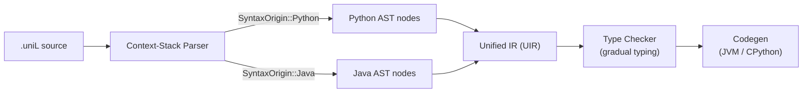
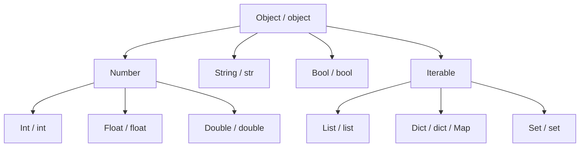
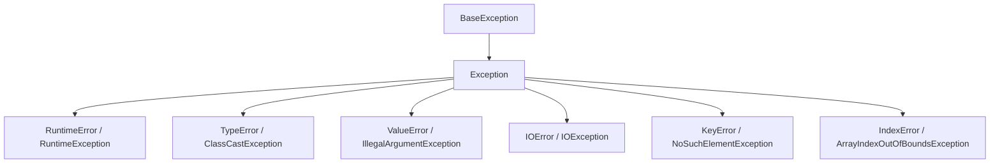
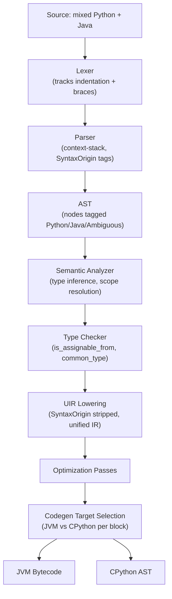

# UniLang -- Cross-Syntax Interoperability Guide

**Version:** 1.0.0-draft
**Last Updated:** 2026-03-21

---

## Table of Contents

1. [Introduction](#1-introduction)
2. [Variable Interoperability](#2-variable-interoperability)
3. [Type Casting Rules](#3-type-casting-rules)
4. [Function Calling -- The Complete Guide](#4-function-calling--the-complete-guide)
5. [Collection Interop](#5-collection-interop)
6. [Exception/Error Handling Interop](#6-exceptionerror-handling-interop)
7. [Threading Interop](#7-threading-interop)
8. [Common Patterns and Best Practices](#8-common-patterns-and-best-practices)
9. [Quick Reference Table](#9-quick-reference-table)

---

## 1. Introduction

### Philosophy: "Write what feels natural, it just works"

UniLang is built on a single guiding principle: **developers should never fight the
language to make their code work.** A Python developer and a Java developer can open
the same `.uniL` file, each write code in the style they know best, and have it
compile and run correctly -- without explicit bridges, adapters, wrapper objects, or
conversion calls.

This is not a foreign-function interface. There is no marshalling layer that you
invoke by hand. The UniLang compiler's context-stack parser (see
[DD-002](DESIGN_DECISIONS.md#dd-002-syntax-ambiguity-resolution)) determines the
syntax origin of every construct, and the gradual type system (see
[TYPE_SYSTEM.md](TYPE_SYSTEM.md)) resolves types across both styles automatically.

### What "seamless" means in practice

- A Python-style variable can be passed to a Java-style method parameter. The
  compiler inserts the necessary runtime type check (if the target is statically
  typed) or accepts it directly (if the target is `Dynamic`).
- A Java-typed return value can be assigned to a Python-style untyped variable.
  The value keeps its concrete type at runtime; the variable simply has a
  `Dynamic` compile-time type.
- Collections, exceptions, threads, and objects all cross the syntax boundary
  without ceremony. The rest of this document shows exactly how.

### How the compiler makes it work



The parser tags every construct with a `SyntaxOrigin` -- `Python`, `Java`,
`Ambiguous`, or `UniLang` -- but by the time code reaches the Unified IR, both
styles have been lowered to the same representation. Interop is therefore not a
runtime bridge between two languages; it is a **compile-time unification** into a
single semantic model.

---

## 2. Variable Interoperability

### Declaring variables in both styles

```unilang
// Python-style declaration (type inferred as Dynamic)
name = "Alice"
age = 30
scores = [90, 85, 95]

// Java-style declaration (explicitly typed)
String greeting = "Hello"
int count = 10
List<Integer> numbers = new ArrayList<>()
```

Both groups of variables live in the same scope and are fully visible to each
other. There is no "Python world" and "Java world" -- there is only the current
scope.

### Cross-syntax operations

Every combination of Python-style and Java-style values works in expressions:

```unilang
// String concatenation across styles
message = greeting + " " + name     // Java String + Python str -> String

// Arithmetic across styles
total = count + age                  // Java int + Python int -> int

// Collection merging across styles
combined = scores + numbers          // Python list + Java List -> merged list

// Comparison across styles
is_adult = age >= count              // Python int >= Java int -> bool
```

### Why this works: the unified type hierarchy

Under the hood, UniLang has a single type hierarchy. `int` (Java keyword) and the
integer inferred from `age = 30` (Python style) both resolve to the same `Type::Int`
in the compiler's type system. The `SyntaxOrigin` tag affects parsing, not semantics.



Python's `int` and Java's `int` are the **same node** in this graph. There is no
conversion between them because there is nothing to convert.

### Assignment across styles

```unilang
// Assign Java-typed value to Python-style variable
x = count                           // x is Dynamic at compile time, Int at runtime

// Assign Python-style value to Java-typed variable
int y = age                          // Compile-time check: age's inferred type is Int -> OK

// Assign Python-style value to Java-typed variable (type unknown)
int z = some_python_func()           // Runtime check inserted: result must be Int
```

The compiler follows these rules (from [TYPE_SYSTEM.md](TYPE_SYSTEM.md)):

1. `Dynamic` assigned **to** any type -- always compiles; runtime check inserted.
2. Any type assigned **to** `Dynamic` -- always compiles; no check needed.
3. Concrete type assigned **to** compatible concrete type -- compiles if
   `is_assignable_from` passes; no runtime overhead.

---

## 3. Type Casting Rules

### Implicit conversions (automatic)

The compiler applies these conversions silently when it can prove safety at compile
time or inserts a runtime check where it cannot.

| From | To | Behavior | Example |
|------|----|----------|---------|
| `int` (Java) | `Dynamic` (Python) | Always works, zero cost | `x = java_int` |
| `Dynamic` (Python) | `int` (Java) | Runtime type check inserted | `int x = python_var` |
| `Int` | `Float` | Widening -- automatic | `float f = 10` |
| `Int` | `Double` | Widening -- automatic | `double d = 10` |
| `Float` | `Double` | Widening -- automatic | `double d = 3.14f` |
| `Bool` | `Int` | Widening -- `True` -> 1, `False` -> 0 | `int x = True` |
| `Any` | `String` | Automatic with `+` operator | `"count: " + 42` -> `"count: 42"` |
| `null` / `None` | `Optional<T>` | Null safety -- automatic | `Optional<String> s = None` |
| `null` / `None` | Class type | Allowed (nullable reference) | `String s = null` |
| `T` | `Optional<T>` | Wrapping -- automatic | `Optional<int> x = 42` |
| `python list` | `Java List<T>` | VM boundary crossing | `List<int> jl = [1, 2, 3]` |
| `python dict` | `Java Map<K,V>` | VM boundary crossing | `Map<String, int> m = {"a": 1}` |
| `Java String` | `python str` | VM boundary crossing | `name = javaString` |

### Explicit conversions (required)

These conversions can lose information or fail, so the compiler requires you to be
explicit. Both Python-style and Java-style cast syntax are accepted.

| From | To | Python Syntax | Java Syntax | Notes |
|------|----|--------------|-------------|-------|
| `Float` | `Int` | `int(f)` | `(int) f` | Truncates toward zero |
| `Double` | `Int` | `int(d)` | `(int) d` | Truncates toward zero |
| `String` | `Int` | `int(s)` | `Integer.parseInt(s)` | Raises/throws on bad input |
| `String` | `Float` | `float(s)` | `Float.parseFloat(s)` | Raises/throws on bad input |
| `Object` | Specific type | N/A | `(Type) obj` | ClassCastException if wrong |
| `Dynamic` | Specific type | `Type(val)` or type check | `(Type) val` | Runtime check |

### Narrowing produces a warning

When the compiler detects a narrowing conversion that could lose data, it emits a
warning but still compiles:

```unilang
float pi = 3.14159
int truncated = int(pi)       // WARNING: narrowing conversion Float -> Int (value will be 3)
```

Suppress the warning with an explicit cast to signal intent:

```unilang
int truncated = (int) pi      // No warning -- explicit cast signals developer intent
```

### The `Dynamic` propagation rule

When `Dynamic` participates in an operation, the result is `Dynamic`:

```unilang
x = unknown_func()           // x: Dynamic
y = x + 10                   // y: Dynamic (Dynamic + Int -> Dynamic)
z = x * 2.5                  // z: Dynamic (Dynamic * Float -> Dynamic)

// Pin to a concrete type to stop propagation:
int result = x + 10          // result: Int (runtime check on x)
```

---

## 4. Function Calling -- The Complete Guide

This section covers **every** way functions and methods can be defined and called
across syntax styles. Each subsection stands alone -- read the ones relevant to your
use case or read them all for a complete picture.

### 4a. Python-style function in Python-style class

The pure Python experience. No type annotations, `self` parameter, colon-delimited
blocks.

```unilang
class Calculator:
    def add(self, x, y):
        return x + y

    def multiply(self, x, y):
        return x * y

calc = Calculator()
result = calc.add(5, 3)          // returns 8 (Dynamic)
product = calc.multiply(4, 7)    // returns 28 (Dynamic)
```

All parameters and the return value have compile-time type `Dynamic`. Type errors
(e.g., passing a string where arithmetic is expected) surface at runtime.

### 4b. Java-style method in Java-style class

The pure Java experience. Access modifiers, explicit types, brace-delimited blocks.

```unilang
public class Calculator {
    public int add(int a, int b) {
        return a + b;
    }

    public int multiply(int a, int b) {
        return a * b;
    }
}

Calculator calc = new Calculator();
int result = calc.add(5, 3);        // returns 8 (int, compile-time verified)
int product = calc.multiply(4, 7);  // returns 28 (int, compile-time verified)
```

All parameters and the return value are statically typed. Type mismatches are caught
at compile time.

### 4c. Mixed class -- Java class with Python methods

This is where UniLang's interop shines. A single class can contain methods written
in either style. The compiler resolves each method independently by its syntax
origin.

```unilang
public class DataProcessor {
    private List<Integer> data;

    // Java-style constructor
    public DataProcessor(List<Integer> data) {
        this.data = data;
    }

    // Python-style method inside a Java class
    def process(self):
        return sum(self.data) / len(self.data)

    // Java-style method that calls the Python-style method
    public double getAverage() {
        return self.process();   // Java method calls Python method
    }

    // Python-style method that calls the Java-style field
    def describe(self):
        return f"DataProcessor with {len(self.data)} items, avg={self.getAverage()}"
}
```

Creating and using the mixed class:

```unilang
// Python-style construction (no 'new' keyword)
proc = DataProcessor([1, 2, 3, 4, 5])

// Java-style construction
DataProcessor proc2 = new DataProcessor([1, 2, 3, 4, 5])

// Call Python-style method
avg = proc.process()               // Dynamic return type

// Call Java-style method
double avg2 = proc.getAverage()    // double return type

// Call Python-style method that uses Java-style internals
desc = proc.describe()             // Dynamic return type
```

**Key insight:** `self` works identically in both styles. Whether you write
`self.data` inside a `def` method or inside a Java method, it refers to the same
instance field. The `self` keyword is syntax-origin-independent.

### 4d. Python function accepting Java-typed arguments

Python-style functions accept arguments of any type. When a Java-typed value is
passed, its concrete type is preserved at runtime even though the parameter is
`Dynamic` at compile time.

```unilang
def calculate_tax(amount, rate):
    return amount * rate

// All of these work:
double price = 99.99;
int taxPercent = 8;
tax = calculate_tax(price, taxPercent)     // Java vars -> Python func
tax2 = calculate_tax(100.0, 0.08)          // Literals
tax3 = calculate_tax(price, 0.08)          // Mixed: Java var + literal

// Even complex Java types work:
BigDecimal precise_price = new BigDecimal("99.99")
tax4 = calculate_tax(precise_price, 0.08)  // Java object -> Python func
```

The compiler does **not** insert any conversion. The Java `double` value `99.99`
arrives in `amount` as-is. The Python-style `*` operator dispatches based on the
runtime type of both operands.

### 4e. Java method accepting Python variables

When Python-style (untyped) values are passed to Java-style (typed) parameters, the
compiler inserts runtime type checks at the call site.

```unilang
public class Formatter {
    public static String format(String template, Object... args) {
        // Java-style string formatting
        return String.format(template, args);
    }
}

name = "Alice"           // Python variable (Dynamic, runtime type: String)
age = 30                 // Python variable (Dynamic, runtime type: Int)

// Python vars passed to Java static method -- runtime check ensures
// name is String-compatible and age is Object-compatible
result = Formatter.format("Hello %s, age %d", name, age)
```

If `name` held a non-String value at runtime, a `TypeError` / `ClassCastException`
would be raised at the call site, with a clear message indicating which argument
failed the type check.

### 4f. Static methods and module-level functions

Static methods (Java) and module-level functions (Python) are conceptually the same
thing: functions that do not require an instance. UniLang treats them uniformly.

```unilang
// Java-style static method call
double root = Math.sqrt(16)
Collections.sort(myList)
String joined = String.join(", ", names)

// Python-style module function call
import math
root = math.sqrt(16)

result = sorted(myList)
joined = ", ".join(names)
```

Both styles can operate on the same data:

```unilang
data = [3, 1, 4, 1, 5, 9]

// Python built-in
sorted_py = sorted(data)

// Java utility
Collections.sort(data)      // Sorts in place

// Both produce valid sorted output from the same input
```

### 4g. Constructor patterns

Objects can be created using either Java-style (`new` keyword) or Python-style
(direct call) syntax. Both produce the same object.

```unilang
// Java-style: new keyword, explicit type on left
Calculator calc = new Calculator()
ArrayList<String> list = new ArrayList<>()
HashMap<String, Integer> map = new HashMap<>()

// Python-style: direct call, no new keyword, no left-side type
calc = Calculator()
list = ArrayList()
map = HashMap()

// Mixed: new keyword with Python-style variable binding
calc = new Calculator()

// Mixed: Python-style call with Java-style type on left
Calculator calc = Calculator()
```

All four styles above create identical objects. The `new` keyword is syntactic --
the compiler strips it during lowering to UIR.

### 4h. Lambda and closure interop

Java lambdas and Python lambdas are interchangeable:

```unilang
// Python lambda
square = lambda x: x * x

// Java lambda (arrow syntax)
Function<Integer, Integer> square_j = (x) -> x * x;

// Pass Python lambda where Java functional interface expected
list.stream()
    .map(lambda x: x * 2)          // Python lambda in Java stream
    .filter(lambda x: x > 10)
    .collect(Collectors.toList())

// Pass Java lambda to Python's built-in functions
result = list(map((x) -> x * 2, data))     // Java lambda in Python map()
sorted_data = sorted(data, key=lambda x: -x)
```

### 4i. Keyword arguments and overloading

Python supports keyword arguments. Java supports method overloading. Both work in
UniLang and can coexist.

```unilang
public class HttpClient {
    // Java-style overloaded methods
    public Response get(String url) { ... }
    public Response get(String url, Map<String, String> headers) { ... }

    // Python-style method with keyword arguments
    def post(self, url, data=None, headers=None, timeout=30):
        ...
}

client = HttpClient()

// Java overload resolution
response = client.get("https://api.example.com")
response = client.get("https://api.example.com", headers)

// Python keyword arguments
response = client.post("https://api.example.com",
                        data=payload,
                        timeout=60)
```

---

## 5. Collection Interop

### Unified collection model

Python lists and Java Lists, Python dicts and Java Maps, Python sets and Java Sets
are unified under a common interface. Operations from either language work on
collections created in either style.

```unilang
// Python list
py_list = [1, 2, 3]

// Java ArrayList
ArrayList<Integer> java_list = new ArrayList<>()
java_list.add(4)
java_list.add(5)
```

### Cross-style operations

```unilang
// Concatenation across styles
combined = py_list + java_list        // [1, 2, 3, 4, 5]

// Python methods on Python lists
py_list.append(6)                     // [1, 2, 3, 6]

// Java methods on Java lists
java_list.add(7)                      // [4, 5, 7]

// Python methods on Java lists (works!)
java_list.append(8)                   // Compiler maps to java_list.add(8)

// Java methods on Python lists (works!)
py_list.add(9)                        // Compiler maps to py_list.append(9)

// Python built-ins on Java collections
length = len(java_list)               // 4
total = sum(java_list)                // 24
minimum = min(java_list)              // 4
```

### Iteration works across styles

```unilang
// Python-style for-in on a Python list
for item in py_list:
    print(item)

// Python-style for-in on a Java collection (works!)
for item in java_list:
    print(item)

// Java enhanced for-each on a Java list
for (int item : java_list) {
    System.out.println(item)
}

// Java enhanced for-each on a Python list (works!)
for (int item : py_list) {
    System.out.println(item)
}
```

### Dictionary / Map interop

```unilang
// Python dict
py_dict = {"name": "Alice", "age": 30}

// Java HashMap
HashMap<String, Object> java_map = new HashMap<>()
java_map.put("name", "Bob")
java_map.put("age", 25)

// Python-style access on both
print(py_dict["name"])                // "Alice"
print(java_map["name"])               // "Bob" -- bracket access mapped to .get()

// Java-style access on both
String name1 = py_dict.get("name")    // "Alice" -- .get() mapped to bracket access
String name2 = java_map.get("name")   // "Bob"

// Python 'in' operator works on Java maps
if "name" in java_map:
    print("found it")

// Merging across styles
merged = {**py_dict, **java_map}      // Python unpacking works with Java maps
```

### Comprehensions and streams

Python comprehensions and Java streams are both available and can process collections
from either origin:

```unilang
numbers = [1, 2, 3, 4, 5, 6, 7, 8, 9, 10]

// Python list comprehension
evens_py = [x for x in numbers if x % 2 == 0]

// Java stream
List<Integer> evens_java = numbers.stream()
    .filter(x -> x % 2 == 0)
    .collect(Collectors.toList())

// Python comprehension on a Java collection
ArrayList<Integer> javaNumbers = new ArrayList<>(numbers)
evens_mixed = [x for x in javaNumbers if x % 2 == 0]

// Java stream on a Python list
List<Integer> evens_mixed2 = numbers.stream()
    .filter(x -> x % 2 == 0)
    .collect(Collectors.toList())
```

---

## 6. Exception/Error Handling Interop

### The unified exception hierarchy

UniLang maps Python exceptions and Java exceptions into a single hierarchy. At the
root is `Exception` (accessible as both `Exception` in Java and `Exception` in
Python). Language-specific exceptions are subclasses.



### Python-style try/except catches Java exceptions

```unilang
public class FileReader {
    public static String read(String path) throws IOException {
        // Java-style file reading that may throw IOException
    }
}

// Python-style exception handling catches the Java IOException
try:
    content = FileReader.read("/etc/config")
except IOError as e:
    print(f"Failed to read file: {e}")
except Exception as e:
    print(f"Unexpected error: {e}")
finally:
    print("Cleanup complete")
```

### Java-style try/catch catches Python exceptions

```unilang
def parse_json(text):
    // Python-style parsing that may raise ValueError
    if not text.startswith("{"):
        raise ValueError("Not valid JSON")
    return json.loads(text)

// Java-style exception handling catches the Python ValueError
try {
    result = parse_json(input_text)
} catch (ValueError e) {
    System.out.println("Parse error: " + e.getMessage())
} catch (Exception e) {
    System.out.println("Unexpected: " + e.getMessage())
} finally {
    System.out.println("Done")
}
```

### Mixed exception handling in a single block

```unilang
try:
    data = FileReader.read("data.json")         // May throw Java IOException
    parsed = parse_json(data)                    // May raise Python ValueError
    result = process(parsed)                     // May raise any exception
except IOError as e:
    print("File error")
except ValueError as e:
    print("Parse error")
except Exception as e:
    print(f"Other error: {e}")
```

### Raising/throwing across styles

```unilang
// Python-style raise, caught by Java-style catch
def validate(x):
    if x < 0:
        raise ValueError("Must be non-negative")

try {
    validate(-1)
} catch (ValueError e) {
    System.out.println(e.getMessage())    // "Must be non-negative"
}

// Java-style throw, caught by Python-style except
public void checkAge(int age) {
    if (age < 0) {
        throw new IllegalArgumentException("Invalid age: " + age);
    }
}

try:
    checkAge(-5)
except ValueError as e:     // IllegalArgumentException maps to ValueError
    print(f"Caught: {e}")
```

---

## 7. Threading Interop

UniLang provides true multi-threading even for Python-style code by compiling it to
JVM bytecode when possible (see [THREADING_MODEL.md](THREADING_MODEL.md) for the
full three-tier strategy). This section focuses on how Python-style and Java-style
code interact in concurrent scenarios.

### Java thread pool executing Python functions

```unilang
ExecutorService executor = Executors.newFixedThreadPool(4)

def process_data(chunk):
    return sum(chunk) / len(chunk)

// Submit Python function to Java thread pool
future = executor.submit(() -> process_data([1, 2, 3, 4]))
result = future.get()          // Blocks until complete, returns Dynamic

// Submit multiple Python functions
chunks = [[1, 2], [3, 4], [5, 6], [7, 8]]
futures = [executor.submit(lambda c=chunk: process_data(c)) for chunk in chunks]
results = [f.get() for f in futures]
```

### Python async/await with Java CompletableFuture

```unilang
async def fetch_user(user_id):
    response = await http_get(f"/api/users/{user_id}")
    return response.json()

// Java CompletableFuture chain calling Python async function
CompletableFuture<User> pipeline = CompletableFuture
    .supplyAsync(() -> fetch_user(123))
    .thenApply(data -> User.fromDict(data))
    .thenApply(lambda user: validate(user))
    .exceptionally(ex -> handle_error(ex))
```

### Synchronized access across styles

```unilang
shared_counter = {"count": 0}    // Python dict as shared state
lock = ReentrantLock()

def increment():
    with lock:                   // Python context manager on Java lock
        shared_counter["count"] += 1

public void decrement() {
    lock.lock();
    try {
        shared_counter["count"] -= 1;    // Java method modifying Python dict
    } finally {
        lock.unlock();
    }
}

// Both functions safely modify the same shared state
executor = Executors.newFixedThreadPool(8)
for i in range(100):
    executor.submit(lambda: increment())
    executor.submit(() -> decrement())
```

### Virtual threads (Project Loom) with Python functions

```unilang
// Python async functions automatically run on virtual threads
async def fetch_all(urls):
    results = []
    for url in urls:
        response = await http_get(url)
        results.append(response)
    return results

// Explicit virtual thread creation with Python function body
Thread.startVirtualThread(() -> {
    data = load_data("input.csv")      // Python function
    processed = transform(data)         // Python function
    save_results(processed)             // Python function
})
```

---

## 8. Common Patterns and Best Practices

### When to use Java-style vs Python-style declarations

| Scenario | Recommended Style | Reason |
|----------|------------------|--------|
| Quick scripting / prototyping | Python | Less boilerplate, faster iteration |
| Performance-critical hot paths | Java | Static types enable compiler optimizations |
| Public API boundaries | Java | Explicit types serve as documentation |
| Data exploration / REPL | Python | Dynamic typing suits exploratory work |
| Concurrent / threaded code | Java | Explicit types prevent subtle race-condition bugs |
| ML / data science pipelines | Python | Ecosystem conventions, C-extension compat |
| Internal helper functions | Either | Use what the team prefers |
| Mixed teams (Python + Java devs) | Both | Each developer uses their native style |

### Performance considerations

Statically typed code runs faster than dynamically typed code because the compiler
can eliminate runtime type checks and optimize dispatch.

```unilang
// SLOWER: Dynamic types -- runtime dispatch on every operation
def matrix_multiply(a, b):
    result = [[0] * len(b[0]) for _ in range(len(a))]
    for i in range(len(a)):
        for j in range(len(b[0])):
            for k in range(len(b)):
                result[i][j] += a[i][k] * b[k][j]
    return result

// FASTER: Static types -- compiler knows sizes and types at compile time
public double[][] matrixMultiply(double[][] a, double[][] b) {
    double[][] result = new double[a.length][b[0].length];
    for (int i = 0; i < a.length; i++) {
        for (int j = 0; j < b[0].length; j++) {
            for (int k = 0; k < b.length; k++) {
                result[i][j] += a[i][k] * b[k][j];
            }
        }
    }
    return result;
}
```

**Rule of thumb:** If a function is called millions of times or processes large data
in a tight loop, add types. For everything else, use whatever reads best.

### Naming conventions

Both `camelCase` (Java convention) and `snake_case` (Python convention) are valid
identifiers. UniLang does not enforce one over the other, but consistency within a
file or module is recommended.

```unilang
// Both naming conventions coexist peacefully
def calculate_average(data_points):        // Python: snake_case
    return sum(data_points) / len(data_points)

public double calculateAverage(List<Double> dataPoints) {   // Java: camelCase
    return dataPoints.stream().mapToDouble(d -> d).average().orElse(0.0);
}

// Calling either from either style
result1 = calculate_average([1.0, 2.0, 3.0])
double result2 = calculateAverage(dataPoints)
```

### Gradual migration pattern

Start dynamic, add types as the code matures:

```unilang
// Phase 1: Prototype (pure Python style)
def process(data):
    result = transform(data)
    return aggregate(result)

// Phase 2: Add type hints for documentation
def process(data: list) -> dict:
    result = transform(data)
    return aggregate(result)

// Phase 3: Full Java-style types for production
public Map<String, Object> process(List<DataPoint> data) {
    List<Result> result = transform(data);
    return aggregate(result);
}
```

All three phases are valid UniLang. You can migrate one function at a time without
changing any callers.

### The "typed boundary" pattern

A common best practice is to keep public APIs typed (Java-style) and internal
implementation dynamic (Python-style):

```unilang
public class RecommendationEngine {

    // Public API: fully typed for safety and documentation
    public List<Recommendation> recommend(User user, int count) {
        features = extract_features(user)
        scores = compute_scores(features)
        return rank_and_filter(scores, count)
    }

    // Internal: Python-style for rapid development
    def extract_features(self, user):
        return {
            "age": user.getAge(),
            "history": user.getPurchaseHistory(),
            "preferences": user.getPreferences()
        }

    def compute_scores(self, features):
        // ... complex logic, iterated on frequently
        return scores

    def rank_and_filter(self, scores, count):
        sorted_scores = sorted(scores.items(), key=lambda x: -x[1])
        return [Recommendation(k, v) for k, v in sorted_scores[:count]]
}
```

---

## 9. Quick Reference Table

### Variable and type operations

| Task | Python Style | Java Style | Both Work? |
|------|-------------|-----------|------------|
| Declare variable | `x = 10` | `int x = 10` | Yes |
| Declare string | `s = "hello"` | `String s = "hello"` | Yes |
| Declare list | `lst = [1, 2, 3]` | `List<Integer> lst = new ArrayList<>()` | Yes |
| Declare dict/map | `d = {"k": "v"}` | `Map<String, String> m = new HashMap<>()` | Yes |
| Type annotation | `x: int = 10` | `int x = 10` | Yes |
| Nullable type | `x: Optional[str] = None` | `String? x = null` | Yes |
| Type cast | `int(x)` | `(int) x` | Yes |

### Function and class operations

| Task | Python Style | Java Style | Both Work? |
|------|-------------|-----------|------------|
| Define function | `def foo(x):` | `void foo(int x) {}` | Yes |
| Define method | `def bar(self, x):` | `public void bar(int x) {}` | Yes |
| Define class | `class Foo:` | `public class Foo {}` | Yes |
| Inherit | `class Foo(Bar):` | `class Foo extends Bar {}` | Yes |
| Create object | `obj = MyClass()` | `MyClass obj = new MyClass()` | Yes |
| Call method | `obj.method()` | `obj.method()` | Yes (same syntax) |
| Static call | `module.func()` | `Class.method()` | Yes |
| Lambda | `lambda x: x * 2` | `(x) -> x * 2` | Yes |
| Keyword args | `f(x=10, y=20)` | N/A (use overloading) | Python only |
| Varargs | `def f(*args):` | `void f(int... args) {}` | Yes |

### Control flow

| Task | Python Style | Java Style | Both Work? |
|------|-------------|-----------|------------|
| If statement | `if x > 0:` | `if (x > 0) {}` | Yes |
| Else if | `elif x < 0:` | `else if (x < 0) {}` | Yes |
| For loop (range) | `for i in range(10):` | `for (int i = 0; i < 10; i++) {}` | Yes |
| For-each | `for item in items:` | `for (var item : items) {}` | Yes |
| While loop | `while x > 0:` | `while (x > 0) {}` | Yes |
| Try/except | `try: ... except E as e:` | `try {} catch (E e) {}` | Yes |
| Raise/throw | `raise ValueError("msg")` | `throw new ValueError("msg")` | Yes |
| Context mgr | `with resource:` | try-with-resources | Yes |

### Collections

| Task | Python Style | Java Style | Both Work? |
|------|-------------|-----------|------------|
| Add to list | `lst.append(x)` | `lst.add(x)` | Yes |
| Get list item | `lst[0]` | `lst.get(0)` | Yes |
| List length | `len(lst)` | `lst.size()` | Yes |
| Sort list | `sorted(lst)` | `Collections.sort(lst)` | Yes |
| Dict/Map get | `d["key"]` | `m.get("key")` | Yes |
| Dict/Map put | `d["key"] = val` | `m.put("key", val)` | Yes |
| Check contains | `x in collection` | `collection.contains(x)` | Yes |
| Iteration | `for x in coll:` | `for (var x : coll) {}` | Yes |
| Comprehension | `[x*2 for x in lst]` | `lst.stream().map(...)` | Yes |

---

## Appendix A: Compiler Internals for Interop

For contributors and advanced users, here is how the compiler resolves cross-syntax
calls internally.

### Resolution pipeline



### Key compiler functions

- **`Type::is_assignable_from`** -- Determines whether a value of one type can be
  assigned to a variable of another type. `Dynamic` is assignable to/from anything.
- **`Type::common_type`** -- Computes the result type of a binary operation between
  two types. When either operand is `Dynamic`, the result is `Dynamic`. When both
  are numeric, widening rules apply (`Int` < `Float` < `Double`).
- **`SyntaxOrigin`** -- An enum (`Python`, `Java`, `Ambiguous`, `UniLang`) attached
  to every AST node. Used by the parser for disambiguation but transparent to the
  type checker and code generator.

### Type equivalence across syntax origins

The compiler maps both Python and Java type names to the same internal `Type` enum:

| Python Name | Java Name | Internal Type |
|-------------|-----------|---------------|
| `int` | `int`, `Integer`, `long`, `Long` | `Type::Int` |
| `float` | `float`, `Float` | `Type::Float` |
| `bool` | `boolean`, `Boolean` | `Type::Bool` |
| `str` | `String` | `Type::String` |
| `None` | `void` | `Type::Void` |
| `list[T]` | `List<T>` | `Type::Generic("List", [T])` |
| `dict[K, V]` | `Map<K, V>` | `Type::Generic("Map", [K, V])` |
| `Optional[T]` | `T?` | `Type::Optional(T)` |
| (no annotation) | N/A | `Type::Dynamic` |

---

## Appendix B: Error Messages for Interop Issues

When the compiler detects a cross-syntax issue, it produces targeted error messages:

```
error[E0301]: type mismatch in cross-syntax call
  --> src/main.uniL:42:15
   |
42 |     int result = python_func()
   |                  ^^^^^^^^^^^^^ expected `int`, found `Dynamic`
   |
   = help: the Python function `python_func` has no return type annotation
   = help: add a return type: `def python_func() -> int:`
   = note: a runtime type check will be inserted; annotate for compile-time safety
```

```
warning[W0150]: narrowing conversion in cross-syntax assignment
  --> src/main.uniL:58:5
   |
58 |     int count = float_value
   |     ^^^^^^^^^^^^^^^^^^^^^^^^ `Float` -> `Int` truncates decimal part
   |
   = help: use explicit cast to silence: `int count = int(float_value)`
```

---

*This document is part of the UniLang specification. Changes require an RFC and
community review.*
