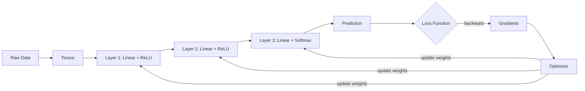

# 1. Core Concepts — ML Explained for Developers

> **Goal**: Understand what tensors, neurons, and neural networks are.
> **Prerequisites**: You can write a `for` loop and know what an array is.

---

## What is Machine Learning?

Machine learning is **function approximation**. You have some input data and want to predict an output, but you don't know the exact formula. So instead of writing the formula by hand, you let the computer **learn** it from examples.

```
Traditional programming:    Rules + Data  → Answers
Machine learning:           Data + Answers → Rules (the model learns the rules)
```

**Analogy**: Imagine you're teaching someone to sort emails into "spam" and "not spam." Instead of writing 500 `if` statements, you show them 10,000 labeled examples and they figure out the patterns themselves.

---

## Tensor — The Data Container

### What is it?

A **Tensor** is just a multi-dimensional array. That's it.

```
Scalar (0D tensor):   42                         → a single number
Vector (1D tensor):   [1, 2, 3]                  → a list of numbers
Matrix (2D tensor):   [[1, 2], [3, 4]]           → a grid of numbers
3D tensor:            [[[1,2],[3,4]], [[5,6],[7,8]]] → a cube of numbers
```

### Why do we need a custom Tensor class?

Python lists can hold numbers, but they can't do two critical things our ML framework needs:

**1. Fast math on entire arrays at once**

```python
# Python list — must loop through each element
result = []
for i in range(len(a)):
    result.append(a[i] * b[i])

# Our Tensor — one operation on the whole thing
result = a.mul(b)
```

**2. Remember how the result was computed** (for learning — explained later)

```python
# Our Tensor tracks the computation graph
c = a.matmul(b)      # c remembers: "I was made by multiplying a and b"
c.backward()          # So it can tell a and b how to change to improve
```

### Tensor in our framework

```
┌─────────────────────────────────────────┐
│              Tensor                      │
├─────────────────────────────────────────┤
│  data[]        → The actual numbers      │
│  grad[]        → How much to change      │
│  shape[]       → Dimensions [rows, cols] │
│  requiresGrad  → Track changes?          │
│  _backward_ops → How was I computed?     │
├─────────────────────────────────────────┤
│  matmul()      → Matrix multiplication   │
│  add()         → Element-wise addition   │
│  relu()        → Activation function     │
│  sigmoid()     → Squash to [0, 1]        │
│  backward()    → Compute gradients       │
└─────────────────────────────────────────┘
```

**Key operations you'll use:**

| Operation | What it does | Example |
|-----------|-------------|---------|
| `matmul(other)` | Matrix multiply | `[2×3] @ [3×4] → [2×4]` |
| `add(other)` | Add element-wise | `[1,2,3] + [4,5,6] → [5,7,9]` |
| `relu()` | Replace negatives with 0 | `[-2, 3, -1, 5] → [0, 3, 0, 5]` |
| `sigmoid()` | Squash to 0-1 range | `[-2, 0, 2] → [0.12, 0.5, 0.88]` |
| `softmax()` | Turn into probabilities | `[2, 1, 0.5] → [0.59, 0.22, 0.13]` |
| `backward()` | Compute all gradients | Traces back through all operations |

---

## Neuron — The Decision Maker

### What is it?

A **neuron** is the simplest unit that makes a decision. It takes multiple inputs, multiplies each by a **weight** (importance), adds them up, adds a **bias** (default tendency), and passes the result through an **activation function**.

```
                    weights
Inputs:             ┌──────┐
  x1 ──── w1 ──→   │      │
  x2 ──── w2 ──→   │ SUM  │──→ activation ──→ output
  x3 ──── w3 ──→   │ +bias│
                    └──────┘

Math:  output = activation(w1*x1 + w2*x2 + w3*x3 + bias)
```

**Analogy**: Think of a neuron as a tiny voter.
- Each input is a piece of evidence
- Each weight is how much that evidence matters
- The bias is the voter's default opinion
- The activation decides the final vote (yes/no, or how strongly)

### Where is the neuron in our code?

In our framework, we don't create individual neuron objects. Instead, a **Linear layer** represents an entire layer of neurons at once using matrix multiplication. This is much faster.

```
One neuron:        output = w1*x1 + w2*x2 + w3*x3 + bias
                   (3 multiplications, 2 additions)

A layer of 64 neurons: output = X @ W + bias
                       (one matrix multiplication — does all 64 neurons at once)
```

```unilang
// This creates a layer of 64 neurons, each taking 10 inputs
layer = Linear(inFeatures=10, outFeatures=64)

// When you call forward, all 64 neurons compute simultaneously
output = layer.forward(input)   // input: [batch, 10] → output: [batch, 64]
```

The `Linear` class in `core/layers.uniL` is our neuron layer:

```
┌────────────────────────────────────────────────┐
│  Linear Layer = Many Neurons at Once            │
│                                                 │
│  weights: Tensor [in_features × out_features]   │
│           Each column = one neuron's weights     │
│                                                 │
│  bias:    Tensor [1 × out_features]             │
│           Each value = one neuron's bias         │
│                                                 │
│  forward(input):                                │
│     output = input @ weights + bias             │
│     (All neurons compute in one operation)      │
└────────────────────────────────────────────────┘
```

---

## Activation Function — The Non-Linearity

### Why do we need activation functions?

Without activation functions, stacking layers is pointless:

```
Layer 1:  output1 = input × W1 + b1
Layer 2:  output2 = output1 × W2 + b2
Combined: output2 = input × (W1 × W2) + (b1 × W2 + b2)
                   = input × W_combined + b_combined
                   → Same as a SINGLE layer! Adding layers does nothing.
```

Activation functions break this linearity. They bend, squash, or clip the output, allowing the network to learn curves, not just straight lines.

### Common activation functions

```
ReLU (Rectified Linear Unit):
  "If positive, keep it. If negative, make it zero."

  Input:  [-2, -1, 0, 1, 2, 3]
  Output: [ 0,  0, 0, 1, 2, 3]

  Graph:
        output
     3 │      /
     2 │    /
     1 │  /
     0 │──────
    -1 │
       └──────────── input
      -2  0  1  2  3

  When to use: Default choice for hidden layers. Fast and works well.
```

```
Sigmoid:
  "Squash any number into the range [0, 1]."
  Good for: binary classification (yes/no decisions)

  Input:  [-5,  -2,   0,   2,   5]
  Output: [0.01, 0.12, 0.5, 0.88, 0.99]

  Graph:
      1.0 │          ───────
          │        /
      0.5 │──────/
          │    /
      0.0 │───
          └──────────────── input
```

```
Softmax:
  "Turn a list of numbers into probabilities that sum to 1."
  Good for: multi-class classification (which category?)

  Input:  [2.0,  1.0,  0.5]
  Output: [0.59, 0.24, 0.13]  → sums to ~1.0

  Interpretation: "59% class A, 24% class B, 13% class C"
```

---

## Neural Network — Layers Stacked Together

### What is it?

A **neural network** is just layers connected in sequence. Data flows forward through each layer, getting transformed at each step.

```
Input          Layer 1         Layer 2         Layer 3         Output
[10 features]  [10 → 64]      [64 → 32]      [32 → 3]       [3 classes]
    │              │               │               │
    │   ┌──────────┤   ┌──────────┤   ┌──────────┤
    │   │ Linear   │   │ Linear   │   │ Linear   │
    │   │ +ReLU    │   │ +ReLU    │   │ +Softmax │
    │   └──────────┤   └──────────┤   └──────────┤
    │              │               │               │
    ▼              ▼               ▼               ▼
 [x1..x10]    [64 values]     [32 values]     [0.7, 0.2, 0.1]
                                                "Class A"
```

### Why multiple layers?

- **Layer 1** learns simple patterns (e.g., "is this number big?")
- **Layer 2** combines simple patterns into complex ones (e.g., "big number AND small category")
- **Layer 3** combines complex patterns into final decisions (e.g., "this is category A")

**Analogy**: Like an assembly line. Each station (layer) does one transformation. Raw materials go in, finished product comes out.

### In our code

```unilang
from core.layers import Linear, ReLU, Softmax
from core.network import Sequential

// Build the network layer by layer
model = Sequential("my_classifier")
model.add(Linear(10, 64))      // 10 inputs → 64 neurons
model.add(ReLU())               // Activation
model.add(Linear(64, 32))      // 64 → 32 neurons
model.add(ReLU())               // Activation
model.add(Linear(32, 3))       // 32 → 3 output classes
model.add(Softmax())            // Turn into probabilities

model.summary()
```

---

## Training — How the Model Learns

### The learning loop (4 steps, repeated)

```
┌─────────────────────────────────────────────────────────────┐
│                    TRAINING LOOP                             │
│                                                              │
│  ┌──────────┐    ┌──────────┐    ┌──────────┐    ┌────────┐ │
│  │1. FORWARD │───→│2. LOSS   │───→│3. BACKWARD│───→│4.UPDATE│ │
│  │  PASS     │    │  COMPUTE │    │   PASS    │    │ WEIGHTS│ │
│  └──────────┘    └──────────┘    └──────────┘    └────────┘ │
│       │               │               │               │      │
│   Feed data       How wrong       Which weights    Adjust    │
│   through         are we?         caused the       weights   │
│   model                           error?           slightly  │
│                                                              │
│  Repeat this loop thousands of times                        │
│  Each repetition = one "training step"                      │
│  All steps through the data = one "epoch"                   │
└─────────────────────────────────────────────────────────────┘
```

**Step 1 — Forward Pass**: Feed input through the network, get a prediction.
```unilang
prediction = model.forward(input)   // e.g., [0.3, 0.6, 0.1]
```

**Step 2 — Compute Loss**: Measure how wrong the prediction is.
```unilang
loss = loss_fn.compute(prediction, target)   // target was [0, 1, 0]
// Loss = 0.51 (wrong by this much)
```

**Step 3 — Backward Pass**: Figure out which weights caused the error.
```unilang
loss.backward()
// Now every weight has a .grad value saying "change me THIS much"
```

**Step 4 — Update Weights**: Nudge weights in the right direction.
```unilang
optimizer.step()
// weight = weight - learning_rate × gradient
```

**That's it.** The entire mystery of "how AI learns" is these 4 steps repeated thousands of times.

---

## Putting it all together



## Summary

| Concept | What it is | Analogy | Our Code |
|---------|-----------|---------|----------|
| **Tensor** | Multi-dimensional array that tracks its history | A spreadsheet that remembers every formula | `core/tensor.uniL` |
| **Neuron** | Weighted sum + bias + activation | A tiny voter weighing evidence | Inside `Linear` layer |
| **Linear Layer** | Many neurons computed at once via matrix multiplication | A panel of voters | `core/layers.uniL` |
| **Activation** | Non-linear function (ReLU, sigmoid, softmax) | A decision threshold | `core/layers.uniL` |
| **Network** | Layers stacked in sequence | An assembly line | `core/network.uniL` |
| **Loss** | Measures prediction error | A score card | `core/loss.uniL` |
| **Optimizer** | Updates weights to reduce loss | A tuning knob | `core/optimizers.uniL` |
| **Training** | Repeat: forward → loss → backward → update | Practice makes perfect | `core/trainer.uniL` |

**Next**: [2. Architecture →](./02_ARCHITECTURE.md)
