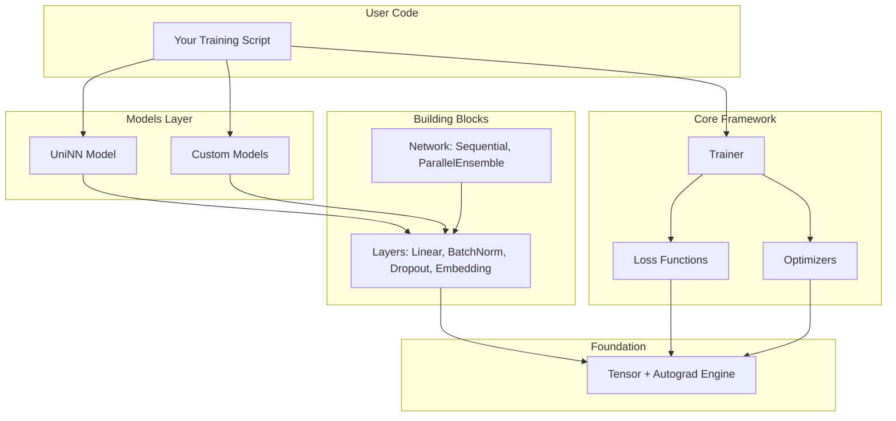
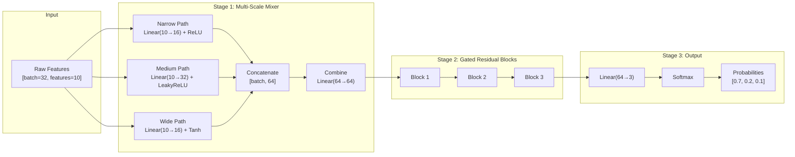
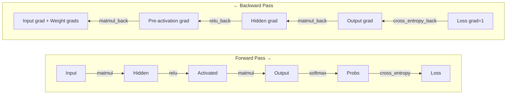
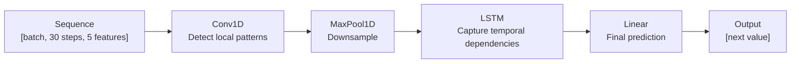
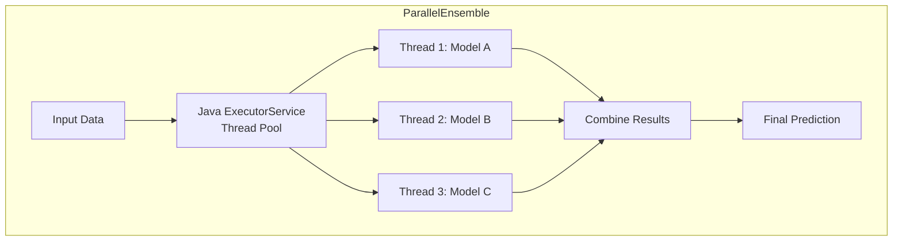

# 2. Framework Architecture

> **Goal**: Understand how the framework is structured, how data flows through it, and why each component exists.

---

## High-Level Architecture



The framework has **4 layers**, each building on the one below:

| Layer | Files | Purpose |
|-------|-------|---------|
| **Foundation** | `core/tensor.uniL` | Math operations + automatic gradient computation |
| **Building Blocks** | `core/layers.uniL`, `core/network.uniL` | Reusable neural network components |
| **Training Tools** | `core/loss.uniL`, `core/optimizers.uniL`, `core/trainer.uniL` | Everything needed to train a model |
| **Models** | `models/uniNN.uniL` | Pre-built model architectures |

---

## File Map — What Each File Does

```
examples/ml-framework/
│
├── core/                          THE FRAMEWORK ENGINE
│   │
│   ├── tensor.uniL               The foundation. Every number in the
│   │                              framework lives inside a Tensor.
│   │                              Handles math AND automatic gradient
│   │                              computation (autograd).
│   │
│   ├── layers.uniL               Building blocks for neural networks.
│   │                              Each layer transforms data in a
│   │                              specific way. Includes:
│   │                              - Linear, BatchNorm, Dropout, Embedding
│   │                              - LSTM (sequential/time series data)
│   │                              - Conv1D, MaxPool1D (local pattern detection)
│   │
│   ├── network.uniL              Containers that organize layers
│   │                              into a complete model.
│   │
│   ├── loss.uniL                 Functions that measure "how wrong
│   │                              is my model's prediction?"
│   │
│   ├── optimizers.uniL           Algorithms that update model weights
│   │                              to reduce the loss.
│   │
│   └── trainer.uniL              The training loop — orchestrates the
│                                  entire learn cycle.
│
├── models/                        PRE-BUILT MODELS
│   └── uniNN.uniL                Our flagship model architecture.
│
├── examples/                      HOW TO USE IT
│   ├── train_model.uniL          Complete training example
│   └── inference_example.uniL    Load & predict example
│
└── docs/                          YOU ARE HERE
```

---

## Data Flow — How a Single Prediction Works

Let's trace what happens when you call `model.forward(input)`:



### Shape transformations at each step

```
Input:           [32, 10]    → 32 samples, 10 features each

Multi-Scale Mixer:
  Narrow path:   [32, 10] × [10, 16] → [32, 16]    (fine patterns)
  Medium path:   [32, 10] × [10, 32] → [32, 32]    (balanced)
  Wide path:     [32, 10] × [10, 16] → [32, 16]    (broad patterns)
  Concatenate:   [32, 16+32+16]      → [32, 64]
  Combine:       [32, 64] × [64, 64] → [32, 64]

Residual Block 1:
  Transform:     [32, 64] → [32, 128] → [32, 64]
  Gate:          [32, 64] → [32, 64]  (sigmoid: values 0-1)
  Output:        gate × transform + (1-gate) × skip → [32, 64]

Residual Block 2: same shape → [32, 64]
Residual Block 3: same shape → [32, 64]

Output Head:     [32, 64] × [64, 3]  → [32, 3]
Softmax:         [32, 3]             → [32, 3]  (probabilities)
```

---

## The Autograd Engine — How Backward Pass Works

This is the most important piece of the framework. When you call `loss.backward()`, the Tensor class traces back through every operation to compute gradients.

### How it works — a simple example

```
Forward pass (compute result):

  a = 2.0                          (input)
  b = 3.0                          (weight)
  c = a × b = 6.0                  (multiplication)
  d = c + 1.0 = 7.0                (add bias)
  loss = (d - 5.0)² = 4.0          (squared error, target=5)

Backward pass (compute gradients):

  d(loss)/d(loss) = 1.0            (starting point)
  d(loss)/d(d)    = 2 × (d - 5) = 2 × 2 = 4.0
  d(loss)/d(c)    = d(loss)/d(d) × d(d)/d(c) = 4.0 × 1.0 = 4.0
  d(loss)/d(b)    = d(loss)/d(c) × d(c)/d(b) = 4.0 × a = 4.0 × 2.0 = 8.0
  d(loss)/d(a)    = d(loss)/d(c) × d(c)/d(a) = 4.0 × b = 4.0 × 3.0 = 12.0

  → b.grad = 8.0  (tells optimizer: "decrease b by 8 × learning_rate")
  → a.grad = 12.0
```

### In our code, each operation stores its backward function:

```unilang
def matmul(self, other) -> Tensor:
    // Forward: compute C = A @ B
    result = // ... matrix multiplication ...

    // Store backward function (closure that remembers A and B)
    def _backward():
        // dL/dA = dL/dC @ B^T    (gradient flows back to A)
        // dL/dB = A^T @ dL/dC    (gradient flows back to B)
        self.grad += result.grad @ other.transpose()
        other.grad += self.transpose() @ result.grad

    result._backward_ops.append(_backward)
    return result
```

When `loss.backward()` is called, it executes all stored `_backward` functions in reverse order — like unwinding a tape recording of all the math.



---

## Why Each Component Exists

### Why Tensor? (not just arrays)

| Feature | Python List | Our Tensor |
|---------|------------|------------|
| Store numbers | Yes | Yes |
| Matrix multiplication | No (must write loops) | Yes (`matmul()`) |
| Track computation history | No | Yes (`_backward_ops`) |
| Compute gradients | No | Yes (`backward()`) |
| Batch operations | No (element by element) | Yes (whole array at once) |

Without our Tensor, you'd need to manually compute derivatives for every operation. With 100,000+ parameters, that's impossible by hand.

### Why Linear? (not individual neurons)

A layer of 64 neurons with 10 inputs each means 640 multiplications. Writing 640 separate operations would be slow and verbose. Matrix multiplication does all 640 in one operation, and hardware (CPU/GPU) is optimized for it.

```
64 separate neurons:              One Linear layer:
  for each neuron (64 times):       output = input @ weights + bias
    for each input (10 times):      (one matrix multiplication)
      multiply and add
  = 640 separate operations         = 1 optimized operation
```

### Why BatchNorm?

Without normalization, numbers in the network can grow huge or shrink to near-zero as they pass through layers. BatchNorm keeps values in a healthy range, making training faster and more stable.

```
Without BatchNorm:  Layer 1 → [0.001, 0.002] → Layer 2 → [0.0000001, 0.0000003] → vanishes!
With BatchNorm:     Layer 1 → [0.001, 0.002] → Normalize → [-0.7, 0.7] → Layer 2 → stable!
```

### Why Dropout?

Dropout randomly turns off neurons during training (sets them to 0). This prevents the network from relying too heavily on any single neuron, forcing it to learn redundant representations. Like studying for an exam — if you can't rely on notes, you actually learn the material.

### Why multiple loss functions?

Different problems need different error measurements:

| Loss | Problem Type | When to Use |
|------|-------------|-------------|
| MSELoss | Regression | Predicting a number (price, temperature) |
| CrossEntropyLoss | Multi-class | Choosing one from many (cat/dog/bird) |
| BCELoss | Binary | Yes/no decisions (spam/not spam) |
| HuberLoss | Robust regression | When data has outliers |

### Why LSTM? (for sequential data)

Linear layers treat each input as an independent bag of features — they have no concept of order. But time series data (stock prices, sensor readings, user sessions) has **sequential dependencies**: what happened 5 minutes ago affects what happens now.

LSTM maintains a **memory cell** that selectively remembers and forgets information across time steps:

```
Linear layer sees:     [temp=22, temp=25, temp=21] → treats as 3 independent numbers
LSTM sees:             temp=22 → temp=25 → temp=21 → "rising then falling — a peak"
```

LSTM is only used when you explicitly create it. If your data is tabular (no time ordering), use Linear layers — they're faster and simpler.

### Why Conv1D? (for local patterns in sequences)

Conv1D is a lighter alternative to LSTM. Instead of remembering everything sequentially, it slides a small window and asks "does this local pattern match?":

```
LSTM:   Reads entire sequence step by step. Slow but captures long-range patterns.
Conv1D: Slides a window. Fast but only sees local patterns (kernel_size steps).
```

Use Conv1D when patterns are local (spikes, dips, short motifs). Use LSTM when distant past matters.

### Why MaxPool1D?

After Conv1D detects patterns, MaxPool1D downsamples by keeping only the strongest signal in each window. This reduces sequence length and computation while preserving the most important features.

### Why multiple optimizers?

| Optimizer | Behavior | When to Use |
|-----------|----------|-------------|
| SGD | Simple, predictable | When you have lots of data and time |
| Adam | Adapts learning rate per parameter | Default choice — works well on most problems |
| RMSProp | Adapts to recent gradient magnitude | Good for noisy or non-stationary problems |

---

## Data Flow — Time Series Model

When building a time series model, data flows differently:



```unilang
// Time series model — explicitly using sequence layers
model = Sequential("stock_predictor")
model.add(Conv1D(inChannels=5, outChannels=16, kernelSize=3))
model.add(MaxPool1D(kernelSize=2))
model.add(LSTM(inputDim=16, hiddenDim=32))
model.add(Linear(32, 1))

// Tabular model — no sequence layers involved, zero overhead
model = UniNN(inputDim=10, hiddenDim=64, outputDim=3, task="classification")
```

---

## Threading Architecture

UniLang's unique advantage: **Java threads for parallel computation**.



In Python, the Global Interpreter Lock (GIL) prevents true parallel execution. UniLang routes thread-heavy work through the JVM, achieving real parallelism:

```unilang
// This runs 3 models TRULY in parallel (not possible in pure Python)
ExecutorService executor = Executors.newFixedThreadPool(3);
for model in models:
    executor.submit(() -> model.forward(input))
```

---

**Next**: [3. UniNN Model Architecture →](./03_UNINN_MODEL.md)
