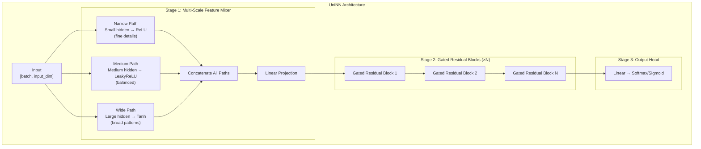

# 3. UniNN Model Architecture

> **Goal**: Understand our custom neural network architecture — what makes it different and how each piece works.

---

## What is UniNN?

**UniNN** (UniLang Neural Network) is an original model architecture we designed from scratch. It's not a copy of ResNet, Transformer, or any existing architecture. It combines three key ideas:

1. **Multi-Scale Feature Mixing** — Look at input data from multiple perspectives simultaneously
2. **Gated Residual Blocks** — Let the network decide how deep it needs to be
3. **Learnable Skip Connections** — Don't force information through every layer

---

## Architecture Overview



---

## Stage 1: Multi-Scale Feature Mixer

### The Problem It Solves

A standard network processes input through a single path at a fixed width. This means it looks at all features at the same "resolution." But real-world patterns exist at different scales:

- **Fine-grained**: "Is this specific word present?"
- **Medium**: "What's the general topic?"
- **Broad**: "What's the overall sentiment?"

### How It Works

The Multi-Scale Mixer processes the input through **three parallel paths**, each with a different width and activation function:

```
                    ┌─────────────────────┐
                    │   Input [batch, D]   │
                    └──────┬──────┬───────┘
                           │      │       │
              ┌────────────┘      │       └────────────┐
              ▼                   ▼                     ▼
    ┌─────────────────┐ ┌─────────────────┐  ┌─────────────────┐
    │  Narrow Path     │ │  Medium Path     │  │  Wide Path       │
    │  Linear(D → D/4) │ │  Linear(D → D/2) │  │  Linear(D → D/4) │
    │  + ReLU          │ │  + LeakyReLU     │  │  + Tanh          │
    │                  │ │                  │  │                  │
    │  Captures fine   │ │  Balanced mix    │  │  Captures broad  │
    │  details         │ │  of patterns     │  │  patterns        │
    └────────┬────────┘ └────────┬────────┘  └────────┬────────┘
             │                   │                     │
             └───────────┬───────┘─────────────────────┘
                         ▼
              ┌─────────────────────┐
              │  Concatenate         │
              │  [D/4 + D/2 + D/4]  │
              │  = [D]              │
              └──────────┬──────────┘
                         ▼
              ┌─────────────────────┐
              │  Linear(D → D)      │
              │  Combine all scales │
              └─────────────────────┘
```

**Why different activations?**

| Path | Activation | What it captures |
|------|-----------|-----------------|
| Narrow | ReLU (clip negatives) | Sharp, decisive features — "is this feature ON or OFF?" |
| Medium | LeakyReLU (small negative slope) | Nuanced features — "how much of this pattern is present?" |
| Wide | Tanh (squash to [-1, +1]) | Balanced features — "positive or negative signal?" |

This diversity means the combined representation is richer than any single path could produce.

---

## Stage 2: Gated Residual Block

### The Problem It Solves

In deep networks, two things go wrong:

1. **Vanishing gradients**: Gradients shrink as they flow backward through many layers, so early layers stop learning
2. **Degradation**: Adding more layers sometimes makes accuracy *worse*, because the network can't learn the identity function (just passing data through unchanged)

**ResNet** solved this with skip connections: `output = transform(x) + x`. But this forces a 50/50 split — half transformed, half original. What if some inputs need more transformation and others need less?

### How Our Gated Residual Block Works

We add a **learnable gate** — a sigmoid that the network learns to control:

```
                    ┌──────────────────────────────────┐
                    │      Gated Residual Block         │
                    │                                   │
    Input ──────────┼──────────┬────────────────────────┤
        │           │          │                        │
        │           │   ┌──────┴──────┐          ┌──────┴──────┐
        │           │   │  Transform   │          │    Gate      │
        │           │   │  Path        │          │    Path      │
        │           │   │              │          │              │
        │           │   │  Linear      │          │  Linear      │
        │           │   │  BatchNorm   │          │  Sigmoid     │
        │           │   │  LeakyReLU   │          │              │
        │           │   │  Dropout     │          │  Output:     │
        │           │   │  Linear      │          │  0.0 to 1.0  │
        │           │   │              │          │  per neuron   │
        │           │   └──────┬──────┘          └──────┬──────┘
        │           │          │                        │
        │           │          ▼                        ▼
        │           │    ┌──────────────────────────────────┐
        │           │    │                                  │
        │           │    │  output = gate × transform       │
        │           │    │         + (1-gate) × skip        │
        │           │    │                                  │
        │           │    │  gate ≈ 1 → use transformation   │
        │           │    │  gate ≈ 0 → pass input through   │
        │           │    │  gate ≈ 0.6 → mix of both        │
        │           │    │                                  │
        │           │    └──────────────┬───────────────────┘
        │           │                   │
        │           └───────────────────┤
        │                               ▼
        └─────────── Skip ──────→   Output
                  Connection
```

### The key insight

```
Standard ResNet:    output = transform(x) + x           (always 50/50)
Our Gated Block:    output = gate(x) × transform(x)
                           + (1 - gate(x)) × x          (learned ratio)
```

The gate `σ(Wx + b)` outputs a value between 0 and 1 **for each neuron independently**:

- **gate = 0.9**: "This input needs heavy transformation" → mostly use the transformed output
- **gate = 0.1**: "This input is already good" → mostly pass it through unchanged
- **gate = 0.5**: "Mix both equally"

This means the network can effectively **choose its own depth** — some inputs skip most blocks, others go through full processing.

### Why each sub-component?

| Component | Purpose |
|-----------|---------|
| **Linear (fc1)** | First transformation — expand to higher dimension |
| **BatchNorm** | Stabilize values between layers |
| **LeakyReLU** | Non-linearity that preserves some negative signal |
| **Dropout** | Regularization — prevent overfitting |
| **Linear (fc2)** | Second transformation — back to original dimension |
| **Gate (sigmoid)** | Learned mixing ratio between transform and skip |
| **Skip projection** | When input/output dimensions differ, project the skip to match |

---

## Stage 3: Output Head

Simple linear projection from hidden dimension to output classes:

```
Classification (3 classes):  Linear(64 → 3) → Softmax → [0.7, 0.2, 0.1]
Binary classification:       Linear(64 → 2) → Sigmoid → [0.85]
Regression:                  Linear(64 → 1) → Raw value → [3.47]
```

---

## Full Parameter Count Example

For a model with `inputDim=10, hiddenDim=64, outputDim=3, numBlocks=3`:

```
Component                    Parameters    Calculation
─────────────────────────────────────────────────────
Multi-Scale Mixer:
  Narrow:  Linear(10→16)     176          (10×16 + 16)
  Medium:  Linear(10→32)     352          (10×32 + 32)
  Wide:    Linear(10→16)     176          (10×16 + 16)
  Combine: Linear(64→64)     4,160        (64×64 + 64)
                             ─────
                             4,864

Gated Residual Block (×3):
  fc1:     Linear(64→128)    8,320        (64×128 + 128)
  fc2:     Linear(128→64)    8,256        (128×64 + 64)
  gate:    Linear(64→64)     4,160        (64×64 + 64)
  norm:    BatchNorm(128)    256          (128 + 128)
                             ─────
                             21,024 × 3 = 63,072

Output Head:
  Linear(64→3)               195          (64×3 + 3)

─────────────────────────────────────────────────────
TOTAL                        68,131 parameters
```

Each parameter is a `double` (8 bytes), so model size ≈ 68,131 × 8 = **545 KB** in memory.

---

## Comparison with Standard Architectures

| Feature | Standard MLP | ResNet | UniNN |
|---------|-------------|--------|-------|
| Skip connections | None | Identity (fixed) | Gated (learned) |
| Input processing | Single path | Single path | Multi-scale (3 paths) |
| Depth adaptivity | Fixed | Fixed | Adaptive (via gate) |
| Activation diversity | Same everywhere | Same everywhere | Different per scale |
| When to use | Simple problems | Image classification | Tabular data, mixed features |

---

## When to Use UniNN

UniNN is designed for **tabular/structured data** — the kind most business applications deal with:

- Customer data (age, purchase history, engagement metrics)
- Financial data (transaction features, risk indicators)
- Sensor data (temperature, pressure, vibration readings)
- Book/product metadata (ratings, categories, usage patterns)

For **images**, use Convolutional networks. For **text**, use Transformers. For **everything else**, UniNN is a strong choice.

---

**Next**: [4. Building Your First Model →](./04_BUILD_YOUR_FIRST_MODEL.md)
