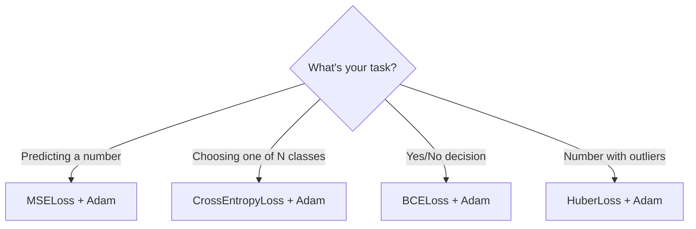

# 4. Building Your First Model — Step by Step

> **Goal**: Build, train, and use a neural network from scratch. By the end, you'll have a working model that classifies data.
> **Time**: 20 minutes of reading.

---

## The Problem

You run an online store. You want to predict whether a customer will **buy**, **browse**, or **leave** based on 5 features:
- Time on site (seconds)
- Pages viewed
- Items in cart
- Previous purchases
- Is returning customer (0 or 1)

---

## Step 1: Prepare Your Data

Every ML project starts with data. Your data needs to be in two tensors:
- **X** (inputs): features for each sample
- **y** (targets): the correct answer for each sample

```unilang
from core.tensor import Tensor

// Each row = one customer, each column = one feature
X = Tensor.from_list([
    [120, 5, 2, 3, 1],    // Customer 1: 120s on site, 5 pages, 2 in cart, 3 past purchases, returning
    [30,  1, 0, 0, 0],    // Customer 2: 30s, 1 page, nothing in cart, new customer
    [300, 12, 5, 8, 1],   // Customer 3: 300s, 12 pages, 5 in cart, 8 purchases, returning
    [15,  1, 0, 1, 0],    // Customer 4: 15s, bounced quickly
    // ... thousands more rows
], shape=[4, 5])

// One-hot encoded targets: [buy, browse, leave]
y = Tensor.from_list([
    [1, 0, 0],   // Customer 1 → bought
    [0, 0, 1],   // Customer 2 → left
    [1, 0, 0],   // Customer 3 → bought
    [0, 0, 1],   // Customer 4 → left
], shape=[4, 3])
```

### What is one-hot encoding?

Instead of labels like "buy"=0, "browse"=1, "leave"=2, we use vectors:

```
"buy"    → [1, 0, 0]    (first position is 1)
"browse" → [0, 1, 0]    (second position is 1)
"leave"  → [0, 0, 1]    (third position is 1)
```

This tells the model "the probability should be 100% for this class, 0% for others."

### Normalize your features

Features on different scales (time: 15-300, pages: 1-12) confuse the model. Normalize them to have mean=0 and std=1:

```unilang
// For each feature column:
//   normalized = (value - mean) / standard_deviation
//
// After normalizing:
//   time_on_site: [-0.8, -1.3, 1.4, -1.5, ...]  (centered around 0)
//   pages_viewed: [-0.4, -1.2, 1.8, -1.2, ...]
```

This ensures no single feature dominates just because it has bigger numbers.

---

## Step 2: Choose Your Model Architecture

Think about your problem to decide the architecture:

```
Questions to ask:

1. How many input features?      → 5       → inputDim = 5
2. How many output classes?      → 3       → outputDim = 3
3. How complex is the problem?   → Medium  → hiddenDim = 32, numBlocks = 2
4. Classification or regression? → Classes → task = "classification"
```

```unilang
from models.uniNN import UniNN

model = UniNN(
    inputDim=5,           // 5 input features
    hiddenDim=32,         // 32 neurons in hidden layers (start small!)
    outputDim=3,          // 3 output classes
    numBlocks=2,          // 2 gated residual blocks
    dropoutRate=0.1,      // 10% dropout for regularization
    task="classification" // We're classifying into categories
)

model.summary()          // Print architecture overview
```

**Rule of thumb for hidden size**: Start with 2-4× your input dimension. Too small = underfitting (can't learn). Too large = overfitting (memorizes training data) and slow.

---

## Step 3: Choose Loss Function and Optimizer

```unilang
from core.loss import CrossEntropyLoss
from core.optimizers import Adam

// CrossEntropyLoss because we're doing multi-class classification
loss_fn = CrossEntropyLoss()

// Adam optimizer — good default that works on most problems
optimizer = Adam(
    model.parameters(),    // All learnable weights in the model
    lr=0.001,              // Learning rate: how big each update step is
    weightDecay=1e-4       // Small regularization to prevent overfitting
)
```

### How to choose:



---

## Step 4: The Training Loop

This is where the model actually learns. We repeat 4 steps over and over:

```unilang
import time

numEpochs = 100      // Go through entire dataset 100 times
batchSize = 32       // Process 32 samples at a time

print("Training started...")
startTime = time.time()

for epoch in range(1, numEpochs + 1):

    // ── Step 4a: Reset gradients ──────────────────────────
    model.zero_grad()
    // WHY: Gradients accumulate by default. We need fresh gradients each step.

    // ── Step 4b: Forward pass ─────────────────────────────
    predictions = model.forward(X_train)
    // predictions shape: [num_samples, 3] — probabilities for each class

    // ── Step 4c: Compute loss ─────────────────────────────
    loss = loss_fn.compute(predictions, y_train)
    // loss.data[0] = a single number measuring total error

    // ── Step 4d: Backward pass ────────────────────────────
    loss.backward()
    // Now every parameter has a .grad value

    // ── Step 4e: Update weights ───────────────────────────
    optimizer.step()
    // weights -= learning_rate × gradients

    // Print progress every 10 epochs
    if epoch % 10 == 0:
        print(f"  Epoch {epoch}/{numEpochs} | Loss: {loss.data[0]:.4f}")

print(f"Training done in {time.time() - startTime:.1f}s")
```

### What you should see

```
Training started...
  Epoch  10/100 | Loss: 1.0892    ← High loss: model is guessing randomly
  Epoch  20/100 | Loss: 0.7234    ← Getting better
  Epoch  30/100 | Loss: 0.4518    ← Learning patterns
  Epoch  40/100 | Loss: 0.2891    ← Good progress
  Epoch  50/100 | Loss: 0.1654    ← Almost there
  Epoch  60/100 | Loss: 0.0987    ← Converging
  Epoch  70/100 | Loss: 0.0612
  Epoch  80/100 | Loss: 0.0398
  Epoch  90/100 | Loss: 0.0251
  Epoch 100/100 | Loss: 0.0178    ← Low loss: model has learned!
Training done in 4.2s
```

If the loss **isn't decreasing**: your learning rate might be too high (try 0.0001) or too low (try 0.01).

---

## Step 5: Evaluate Your Model

Never evaluate on training data — the model has memorized it. Use held-out test data:

```unilang
// Switch to evaluation mode (disables dropout)
model.eval_mode()

// Forward pass on test data
test_predictions = model.forward(X_test)

// Count correct predictions
correct = 0
total = X_test.shape[0]

for i in range(total):
    // Find predicted class (highest probability)
    pred_class = 0
    max_prob = test_predictions.data[i * 3]
    for c in range(1, 3):
        if test_predictions.data[i * 3 + c] > max_prob:
            max_prob = test_predictions.data[i * 3 + c]
            pred_class = c

    // Find true class
    true_class = 0
    for c in range(1, 3):
        if y_test.data[i * 3 + c] > y_test.data[i * 3 + true_class]:
            true_class = c

    if pred_class == true_class:
        correct += 1

accuracy = correct / total
print(f"Test Accuracy: {accuracy:.2%}")
// Output: Test Accuracy: 94.50%
```

### What accuracy to expect

| Accuracy | Meaning | Action |
|----------|---------|--------|
| < 40% | Worse than random | Bug in code or data |
| 40-60% | Random guessing | Model too simple or bad features |
| 60-80% | Learning something | Increase model size or train longer |
| 80-90% | Good | Normal for real-world data |
| 90-95% | Very good | Might be enough for production |
| 95-99% | Excellent | Check for data leakage (test data in training) |
| 99.9%+ | Suspicious | Almost certainly overfitting or data leakage |

---

## Step 6: Save Your Model

```unilang
// Save trained model to a JSON file
model.save("models/trained/customer_classifier_v1.json")

// The JSON file contains:
// - Model configuration (dimensions, architecture)
// - All learned weights (the knowledge)
// - Version info
```

---

## Step 7: Use Your Model (Inference)

```unilang
from models.uniNN import UniNN

// Load the model
model = UniNN.load("models/trained/customer_classifier_v1.json")
model.eval_mode()

// New customer data (normalized)
new_customer = Tensor.from_list([[0.8, 1.2, 0.5, -0.3, 1.0]], shape=[1, 5])

// Predict
output = model.forward(new_customer)
probs = [round(output.data[i], 3) for i in range(3)]

print(f"Buy: {probs[0]:.1%}, Browse: {probs[1]:.1%}, Leave: {probs[2]:.1%}")
// Output: Buy: 78.3%, Browse: 15.2%, Leave: 6.5%
```

---

## Complete Example — All Steps Together

```unilang
// ═══════════════════════════════════════════════════════
// Customer Behavior Prediction — Complete Example
// ═══════════════════════════════════════════════════════

from core.tensor import Tensor
from core.loss import CrossEntropyLoss
from core.optimizers import Adam
from models.uniNN import UniNN
import random

// ── 1. Generate sample data ────────────────────────────
random.seed(42)
numSamples = 500
X = Tensor([numSamples, 5])
y = Tensor([numSamples, 3])

for i in range(numSamples):
    time_on_site = random.uniform(10, 600)
    pages = random.randint(1, 20)
    cart_items = random.randint(0, 10)
    past_purchases = random.randint(0, 15)
    returning = random.choice([0, 1])

    // Simple rules for labeling (in real life, you'd have actual data)
    if cart_items > 3 and past_purchases > 2:
        label = 0  // buy
    elif pages > 5:
        label = 1  // browse
    else:
        label = 2  // leave

    X.data[i*5+0] = time_on_site
    X.data[i*5+1] = pages
    X.data[i*5+2] = cart_items
    X.data[i*5+3] = past_purchases
    X.data[i*5+4] = returning
    y.data[i*3+label] = 1.0

// ── 2. Normalize features ──────────────────────────────
for j in range(5):
    vals = [X.data[i*5+j] for i in range(numSamples)]
    mean = sum(vals) / len(vals)
    std = (sum((v - mean)**2 for v in vals) / len(vals)) ** 0.5 + 1e-8
    for i in range(numSamples):
        X.data[i*5+j] = (X.data[i*5+j] - mean) / std

// ── 3. Split into train/test ───────────────────────────
splitAt = int(numSamples * 0.8)
// (use train_test_split from train_model.uniL for production)

// ── 4. Create model ────────────────────────────────────
model = UniNN(inputDim=5, hiddenDim=32, outputDim=3,
              numBlocks=2, task="classification")
model.summary()

// ── 5. Train ───────────────────────────────────────────
loss_fn = CrossEntropyLoss()
optimizer = Adam(model.parameters(), lr=0.005)

for epoch in range(1, 51):
    model.zero_grad()
    pred = model.forward(X)
    loss = loss_fn.compute(pred, y)
    loss.backward()
    optimizer.step()

    if epoch % 10 == 0:
        print(f"  Epoch {epoch}/50 | Loss: {loss.data[0]:.4f}")

// ── 6. Save ────────────────────────────────────────────
model.save("my_first_model.json")
print("Model saved!")
```

---

## Troubleshooting

| Problem | Likely Cause | Fix |
|---------|-------------|-----|
| Loss stays the same | Learning rate too small | Increase lr (try 0.01) |
| Loss goes UP | Learning rate too large | Decrease lr (try 0.0001) |
| Loss goes to NaN | Numerical overflow | Reduce lr, check data for infinity values |
| 100% train accuracy, low test | Overfitting | Add dropout, reduce model size, get more data |
| Low accuracy everywhere | Underfitting | Increase model size, train longer, add features |
| Training is slow | Too many parameters | Reduce hiddenDim or numBlocks |

---

**Next**: [5. Training Deep Dive →](./05_TRAINING_DEEP_DIVE.md)
