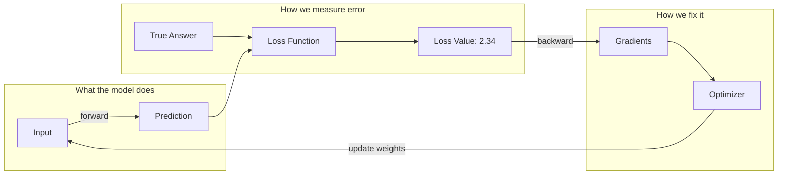
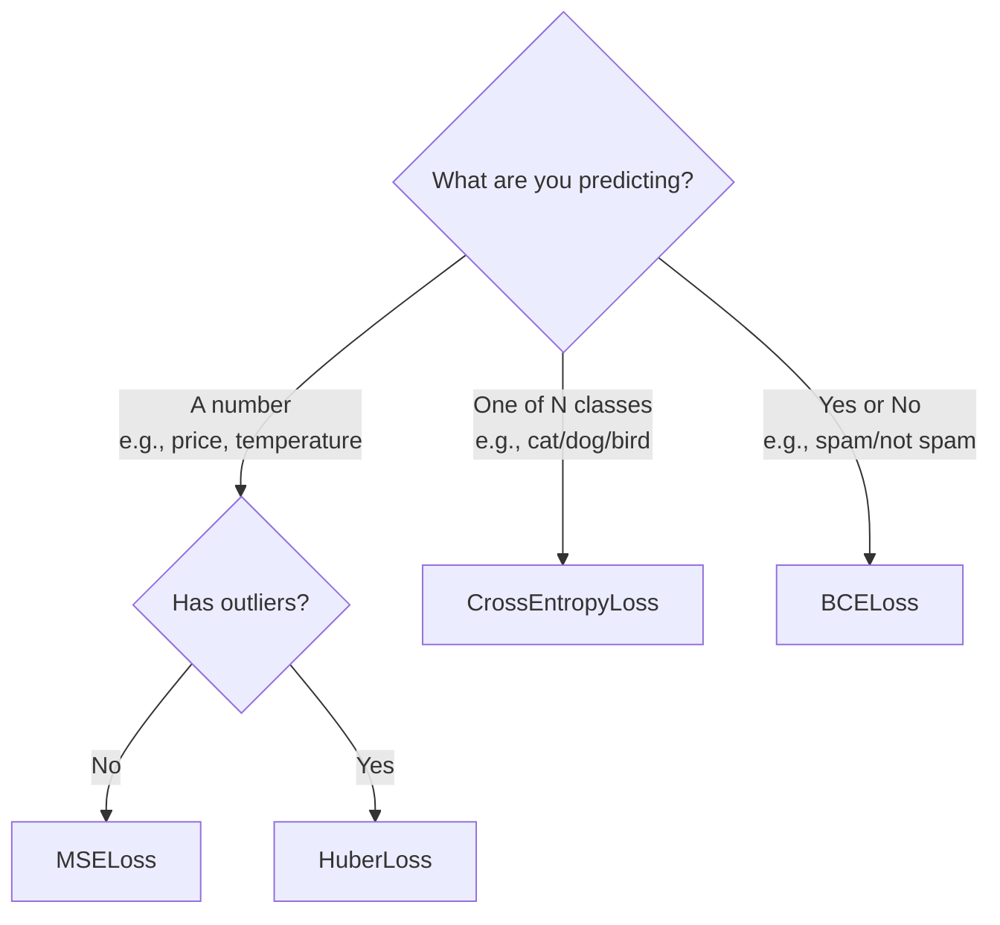

# 5. Training Deep Dive — How Models Actually Learn

> **Goal**: Understand backpropagation, loss functions, and optimizers at a visual level.

---

## The Big Picture



Training is just this loop running thousands of times. Each iteration nudges the model slightly toward better predictions.

---

## Backpropagation — The Chain Rule in Action

### The intuition

Imagine a factory with 3 machines in sequence. The final product is defective. You need to figure out: **which machine caused the defect, and how should each machine be adjusted?**

Backpropagation works backward from the defect (loss) to figure out each machine's (layer's) contribution to the error.

### Visual walkthrough

```
FORWARD PASS (left to right):

  input=2.0 ──→ [×3.0] ──→ 6.0 ──→ [+1.0] ──→ 7.0 ──→ [square] ──→ 49.0
                weight         bias                        loss=(49-25)²=576

  We want the output to be 25.0 (target), but got 49.0. Loss = 576.


BACKWARD PASS (right to left):

  Step 1: How does loss change with the squared output?
          d(loss)/d(output) = 2 × (49 - 25) = 48

  Step 2: How does the squared output change with its input (7.0)?
          d(output)/d(pre_square) = 2 × 7.0 = 14
          Chain: d(loss)/d(pre_square) = 48 × 14 = 672

  Step 3: How does 7.0 change with the bias addition input (6.0)?
          d(7.0)/d(6.0) = 1.0    (addition: gradient is always 1)
          Chain: d(loss)/d(pre_bias) = 672 × 1.0 = 672

  Step 4: How does 6.0 change with the weight (3.0)?
          d(6.0)/d(weight) = input = 2.0
          Chain: d(loss)/d(weight) = 672 × 2.0 = 1344

  Result: weight.grad = 1344
          "Decrease the weight by learning_rate × 1344"
```

### In code — what `backward()` actually does

```unilang
// Each operation stores how to compute its gradient:

// Multiplication: c = a × b
def _backward():
    a.grad += result.grad × b      // "how much did a contribute?"
    b.grad += result.grad × a      // "how much did b contribute?"

// Addition: c = a + b
def _backward():
    a.grad += result.grad × 1.0    // addition passes gradient through unchanged
    b.grad += result.grad × 1.0

// ReLU: c = max(0, a)
def _backward():
    a.grad += result.grad × (1 if a > 0 else 0)
    // If the input was positive, gradient passes through
    // If the input was negative (was clipped to 0), gradient is blocked
```

---

## Loss Functions — Measuring Error

### MSE Loss (Mean Squared Error)

```
Formula:  L = (1/N) × Σ(predicted - target)²

Example:
  Predicted: [3.2, 5.1, 2.8]
  Target:    [3.0, 5.0, 3.0]
  Errors:    [0.2, 0.1, -0.2]
  Squared:   [0.04, 0.01, 0.04]
  Mean:      0.03

Properties:
  ✓ Penalizes large errors more (squared)
  ✓ Always positive
  ✓ Smooth gradient (easy to optimize)
  ✗ Sensitive to outliers (one huge error dominates)
```

### Cross-Entropy Loss

```
Formula:  L = -(1/N) × Σ target × log(predicted)

Example (3 classes):
  Predicted (softmax):  [0.7,  0.2,  0.1]
  Target (one-hot):     [1.0,  0.0,  0.0]   ← correct class is 0

  Loss = -(1.0 × log(0.7) + 0.0 × log(0.2) + 0.0 × log(0.1))
       = -(−0.357)
       = 0.357

  If prediction was [0.99, 0.005, 0.005]:
  Loss = -log(0.99) = 0.01  ← very small loss (confident and correct!)

  If prediction was [0.01, 0.49, 0.50]:
  Loss = -log(0.01) = 4.61  ← huge loss (confident and WRONG!)

Properties:
  ✓ Heavily penalizes confident wrong answers
  ✓ Natural pairing with softmax output
  ✓ Gradient pushes softmax toward one-hot target
```

### Choosing the right loss



---

## Optimizers — How Weights Get Updated

### SGD (Stochastic Gradient Descent)

The simplest optimizer. Like walking downhill with a fixed step size.

```
Rule:  new_weight = old_weight - learning_rate × gradient

Example:
  weight = 3.0
  gradient = 1344    (computed by backward pass)
  learning_rate = 0.001

  new_weight = 3.0 - 0.001 × 1344 = 3.0 - 1.344 = 1.656

With momentum (remembers previous direction):
  velocity = 0.9 × old_velocity + gradient
  new_weight = old_weight - learning_rate × velocity
  → Helps roll through flat regions and small bumps
```

```
SGD without momentum:          SGD with momentum:

  Loss                          Loss
   │    \                        │    \
   │     \   /\  /\ ←stuck      │     \
   │      \_/  \/               │      \_________→ keeps rolling
   │                             │
   └────────────── weight        └────────────── weight
```

### Adam (Adaptive Moment Estimation)

The most popular optimizer. Adapts the learning rate **per parameter**.

```
Adam keeps two running averages per weight:
  m = average of gradients          (which direction to go)
  v = average of squared gradients  (how bumpy the landscape is)

Update rule:
  m_hat = m / (1 - β1^t)           (bias correction)
  v_hat = v / (1 - β2^t)           (bias correction)
  new_weight = old_weight - lr × m_hat / (√v_hat + ε)

What this means:
  - Weights with consistent gradients → big steps (confident direction)
  - Weights with noisy gradients → small steps (uncertain, be careful)
  - Automatically adapts step size for each weight independently
```

```
Gradient landscape:

  Parameter A: consistent gradients → Adam takes BIG steps
  ─────────────→→→→→→→→→ (confident, moves fast)

  Parameter B: noisy gradients → Adam takes SMALL steps
  →←→→←→→←→→←→→ (uncertain, moves carefully)
```

### Learning Rate — The Most Important Hyperparameter

```
Too high (lr=0.1):        Just right (lr=0.001):    Too low (lr=0.000001):

  Loss                      Loss                      Loss
   │  /\   /\               │ \                       │ \
   │ /  \ /  \              │  \                      │  \
   │/    V    \             │   \___                  │   \
   │          ↗             │       \_____            │    \
   │  diverges!             │             \___        │     \__  (too slow!)
   └──────── epochs         └──────── epochs          └──────── epochs
```

### Learning Rate Schedulers

Start with a larger learning rate and decrease over time:

```unilang
from core.optimizers import Adam, CosineAnnealingScheduler

optimizer = Adam(model.parameters(), lr=0.01)
scheduler = CosineAnnealingScheduler(optimizer, totalSteps=100, minLR=0.0001)

for epoch in range(100):
    // ... training step ...
    scheduler.step()    // Gradually reduces learning rate

// Learning rate curve:
//  0.01 │╲
//       │  ╲
//       │    ╲
//       │      ╲
// 0.001 │────────╲_____
//       └────────────── epochs
//       Fast learning    Fine-tuning
//       at start         at end
```

---

## Mini-Batch Training — Why Not Use All Data at Once?

```
Full batch:      Use ALL 10,000 samples per update step
                 ✓ Accurate gradient
                 ✗ Slow (must process everything before one update)
                 ✗ Uses lots of memory

Mini-batch (32): Use 32 samples per update step
                 ✓ Fast (313 updates per epoch instead of 1)
                 ✓ Noisy gradient acts as regularization
                 ✓ Fits in memory
                 ✗ Each individual update is less accurate

Single sample:   Use 1 sample per update step
                 ✗ Extremely noisy gradient
                 ✗ Can't converge reliably
```

**Sweet spot**: Batch size 32-128 for most problems.

---

## Overfitting vs Underfitting

```
               UNDERFITTING              GOOD FIT              OVERFITTING
               (too simple)              (just right)          (too complex)

  Train Loss:  High                      Low                   Very Low
  Test Loss:   High                      Low                   HIGH  ← problem!
  The model:   Can't learn patterns      Generalizes well      Memorized training data

  Visualized (fitting points):

    ·  ·   ·  ·                ·  ·   ·  ·              ·  ·   ·  ·
      ──────────              ·  ·\_/·  ·             ·↗↘·↗↘·↗↘·↗↘·
    · ·    ·  ·              · ·        ·             ·↗  ↘↗  ↘↗    ↘·
                                                       (wiggles through every point)
    "I drew a straight       "I captured the          "I memorized every point
     line through curves"     general curve"           including the noise"
```

### How to fix overfitting

| Technique | How it helps | In our framework |
|-----------|-------------|-----------------|
| **More data** | More examples to generalize from | Collect/generate more samples |
| **Dropout** | Randomly disables neurons during training | `Dropout(rate=0.2)` |
| **Weight decay** | Penalizes large weights | `Adam(params, weightDecay=1e-4)` |
| **Smaller model** | Less capacity to memorize | Reduce `hiddenDim` or `numBlocks` |
| **Early stopping** | Stop when test loss starts rising | Monitor val_loss in training loop |

---

**Next**: [6. Best Practices →](./06_BEST_PRACTICES.md)
