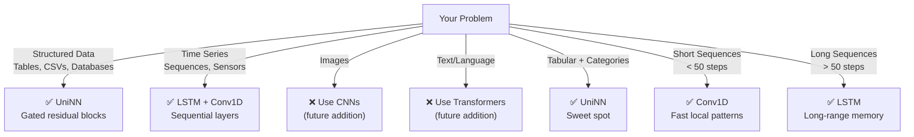
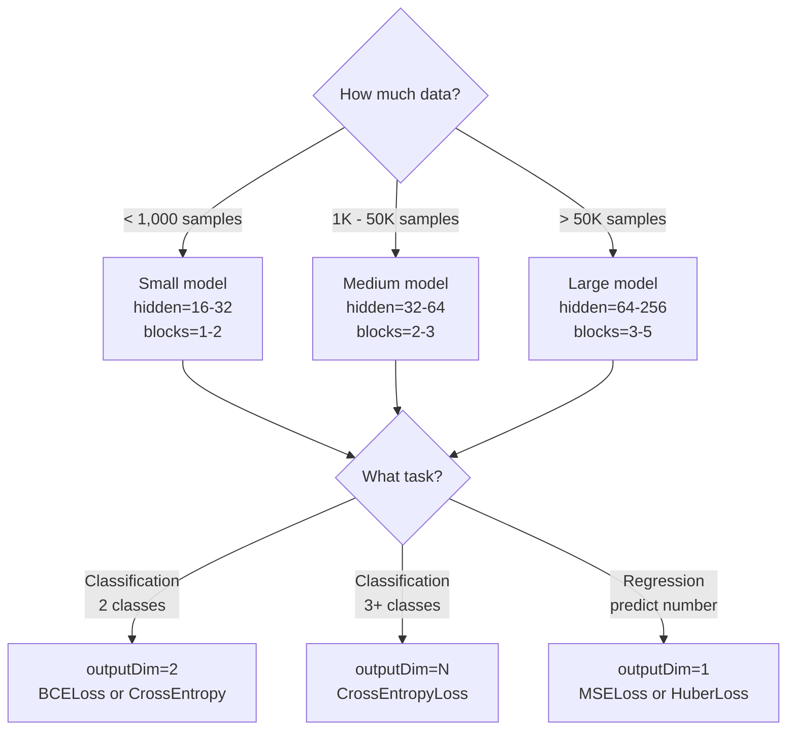

# 8. Use Cases — What Can You Build?

> **Goal**: Understand what problems this framework can solve and see practical examples.

---

## What the framework supports

The framework handles two major data types:

- **Tabular/structured data** (UniNN) — database rows, spreadsheets, feature vectors
- **Sequential/time series data** (LSTM + Conv1D) — ordered data where time matters



---

## Use Case 1: Customer Churn Prediction

**Problem**: Predict which customers will stop using your service next month.

**Input features**: Account age, login frequency, support tickets, feature usage, payment history.

**Output**: Binary — `will_churn` or `will_stay`.

```unilang
model = UniNN(
    inputDim=12,          // 12 customer features
    hiddenDim=32,
    outputDim=2,          // churn or stay
    numBlocks=2,
    task="classification"
)
loss_fn = CrossEntropyLoss()
```

**Why UniNN works well**: Customer behavior has both clear patterns (no login for 30 days = likely churn) and subtle interactions (high usage BUT many support tickets = frustrated power user). The gated residual blocks capture both.

---

## Use Case 2: Pricing Optimization

**Problem**: Predict the optimal price for a product to maximize revenue.

**Input features**: Product category, competitor prices, demand history, seasonality, inventory level.

**Output**: A number — the recommended price.

```unilang
model = UniNN(
    inputDim=15,
    hiddenDim=64,
    outputDim=1,          // single price value
    numBlocks=3,
    task="regression"     // predicting a number
)
loss_fn = MSELoss()
```

---

## Use Case 3: Fraud Detection

**Problem**: Flag suspicious transactions in real-time.

**Input features**: Transaction amount, time of day, merchant category, distance from usual location, velocity (transactions per hour), device fingerprint.

**Output**: Binary — `fraud` or `legitimate`.

```unilang
model = UniNN(
    inputDim=20,
    hiddenDim=64,
    outputDim=2,
    numBlocks=3,
    dropoutRate=0.2,       // Higher dropout — fraud patterns are noisy
    task="classification"
)
loss_fn = CrossEntropyLoss()

// For fraud detection, use Java thread pool for real-time inference
ExecutorService executor = Executors.newFixedThreadPool(8);
// Process multiple transactions in parallel
```

**UniLang advantage**: Java threading enables **real-time parallel inference** — process hundreds of transactions simultaneously without GIL limitations.

---

## Use Case 4: Recommendation Scoring

**Problem**: Score items by how likely a user is to engage with them.

**Input features**: User demographics, item metadata, past interaction history (aggregated), time-based features.

**Output**: Engagement probability (0 to 1).

```unilang
model = UniNN(
    inputDim=30,
    hiddenDim=64,
    outputDim=1,
    numBlocks=2,
    task="regression"
)
loss_fn = BCELoss()    // Binary cross-entropy for probability output
```

---

## Use Case 5: Quality Control / Anomaly Detection

**Problem**: Detect defective products on a manufacturing line from sensor readings.

**Input features**: Temperature, pressure, vibration, speed, humidity, material density (all from sensors).

**Output**: `normal`, `warning`, `defective`.

```unilang
model = UniNN(
    inputDim=8,           // 8 sensor readings
    hiddenDim=32,
    outputDim=3,          // normal, warning, defective
    numBlocks=2,
    task="classification"
)
```

---

## Use Case 6: Ensemble Predictions (Multiple Models)

**Problem**: Your single model gets 88% accuracy. You want 92%.

**Solution**: Train 3 models with different configurations and combine their predictions.

```unilang
// Train 3 different models
model_small = UniNN(inputDim=10, hiddenDim=32, outputDim=3, numBlocks=2)
model_medium = UniNN(inputDim=10, hiddenDim=64, outputDim=3, numBlocks=3)
model_large = UniNN(inputDim=10, hiddenDim=128, outputDim=3, numBlocks=4)

// ... train each model ...

// Combine with parallel ensemble (Java threads!)
from core.network import ParallelEnsemble
ensemble = ParallelEnsemble(
    models=[model_small, model_medium, model_large],
    strategy="weighted"
)
ensemble.weights = [0.2, 0.5, 0.3]  // Weight by validation accuracy

// All 3 models run in parallel on separate JVM threads
result = ensemble.predict(new_data)
```

---

## Use Case 7: Library Book Prediction (from our demo)

This is exactly what we built in the `projects/library-mgmt/` system:

**Problem**: Tag books with prediction labels based on historical data.

**Input features (15)**: totalCheckouts, lateReturns, onTimeReturns, lateReturnRate, averageRating, totalRatings, totalCopies, availableCopies, pageCount, publishYear, bookAge, popularityScore, checkoutsPerCopy, ratingsPerCheckout, isEnglish.

**Output (4 classes)**: `most_likely_booked`, `late_return`, `on_time_return`, `less_likely_booked`.

---

## Use Case 8: Stock Price Prediction (Time Series — LSTM)

**Problem**: Predict tomorrow's closing price based on the last 30 days of market data.

**Input**: Sequence of 30 time steps, each with 6 features (open, high, low, close, volume, moving_avg).

**Output**: Next day's predicted closing price.

```unilang
from core.layers import LSTM, Linear
from core.network import Sequential

model = Sequential("stock_predictor")
model.add(LSTM(inputDim=6, hiddenDim=64, numLayers=2))  // 2-layer LSTM
model.add(Linear(64, 1))                                 // Predict one value

loss_fn = MSELoss()     // Regression — predicting a number
optimizer = Adam(model.parameters(), lr=0.001)

// Input shape: [batch_size, 30, 6] — 30 days, 6 features each
// Output shape: [batch_size, 1] — predicted price
```

**Why LSTM**: Stock prices have long-range dependencies — a pattern from 2 weeks ago can affect today. LSTM's memory cell tracks these across 30 time steps.

---

## Use Case 9: Sensor Anomaly Detection (Time Series — Conv1D)

**Problem**: Detect anomalies in IoT sensor data (temperature, pressure, vibration) on a manufacturing line.

**Input**: Sliding window of 20 readings, each with 4 sensor channels.

**Output**: Binary — `normal` or `anomaly`.

```unilang
from core.layers import Conv1D, MaxPool1D, Linear, ReLU, Sigmoid
from core.network import Sequential

model = Sequential("anomaly_detector")
model.add(Conv1D(inChannels=4, outChannels=16, kernelSize=5, padding=2))
model.add(ReLU())
model.add(MaxPool1D(kernelSize=2))          // 20 steps → 10 steps
model.add(Conv1D(inChannels=16, outChannels=32, kernelSize=3, padding=1))
model.add(ReLU())
model.add(MaxPool1D(kernelSize=2))          // 10 steps → 5 steps
// Flatten: 5 × 32 = 160 features
model.add(Linear(160, 1))
model.add(Sigmoid())                         // Anomaly probability

loss_fn = BCELoss()     // Binary classification
```

**Why Conv1D**: Anomalies are local patterns (sudden spike, rapid drop). Conv1D's sliding window detects these efficiently without the overhead of LSTM.

---

## Use Case 10: Energy Demand Forecasting (Time Series — Hybrid)

**Problem**: Predict next hour's energy demand from 24 hours of historical readings.

```unilang
// Hybrid: Conv1D for local patterns + LSTM for temporal trends
model = Sequential("energy_forecast")
model.add(Conv1D(inChannels=3, outChannels=16, kernelSize=3))   // Local features
model.add(ReLU())
model.add(LSTM(inputDim=16, hiddenDim=32))                      // Temporal memory
model.add(Linear(32, 1))                                         // Predict demand

loss_fn = HuberLoss(delta=1.0)   // Robust to demand spikes (outliers)
```

**Why hybrid**: Conv1D catches short patterns (morning ramp-up), LSTM captures longer cycles (weekday vs weekend).

---

## Deciding Your Architecture



## Step-by-Step: From Problem to Production

```
1. DEFINE THE PROBLEM
   └─ What am I predicting? What data do I have?

2. PREPARE DATA
   ├─ Collect and clean data
   ├─ Define features (inputs) and targets (outputs)
   ├─ Normalize features
   ├─ Split into train / validation / test
   └─ Create Tensors

3. BUILD MODEL
   ├─ Choose architecture size (start small)
   ├─ Choose loss function (match your task)
   └─ Choose optimizer (Adam is usually fine)

4. TRAIN
   ├─ Run training loop
   ├─ Monitor train loss AND validation loss
   ├─ Save best checkpoint
   └─ Stop when validation loss plateaus

5. EVALUATE
   ├─ Test on held-out test data
   ├─ Check accuracy / error metrics
   └─ Verify predictions make intuitive sense

6. DEPLOY
   ├─ model.save("model_v1.json")
   ├─ Load in production: UniNN.load("model_v1.json")
   └─ Use ParallelEnsemble for high-throughput inference
```

---

## What this framework is NOT for (yet)

| Problem | Better Tool | Why |
|---------|------------|-----|
| Image classification | 2D CNNs (PyTorch/TensorFlow) | Images need 2D convolutional layers |
| Text generation | Transformer (GPT-style) | Text needs attention mechanisms |
| Game playing | Reinforcement Learning | Needs reward-based training |
| Very large datasets (100M+) | GPU-accelerated frameworks | CPU too slow at that scale |

These are planned for future versions of the framework.

**Now supported** (that previously wasn't):
- Time series forecasting (LSTM)
- Sensor/signal anomaly detection (Conv1D)
- Sequential pattern recognition (LSTM + Conv1D hybrid)

---

**Back to**: [Documentation Home →](./README.md)
